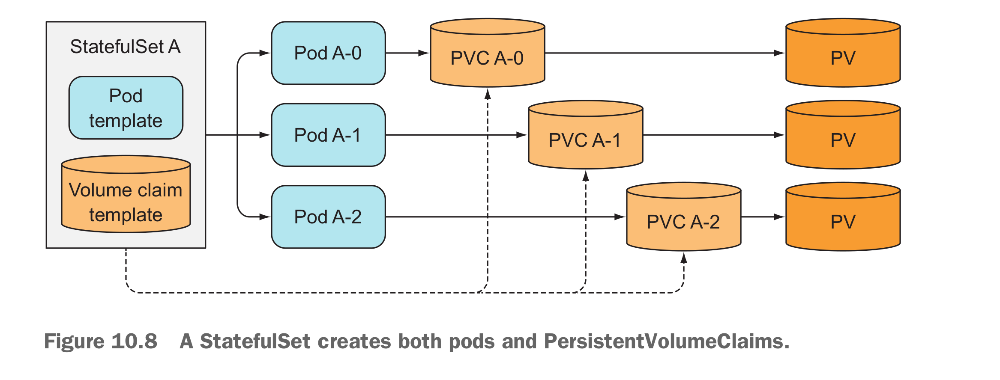
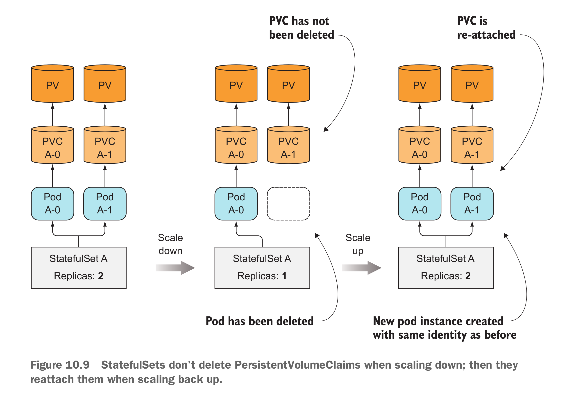
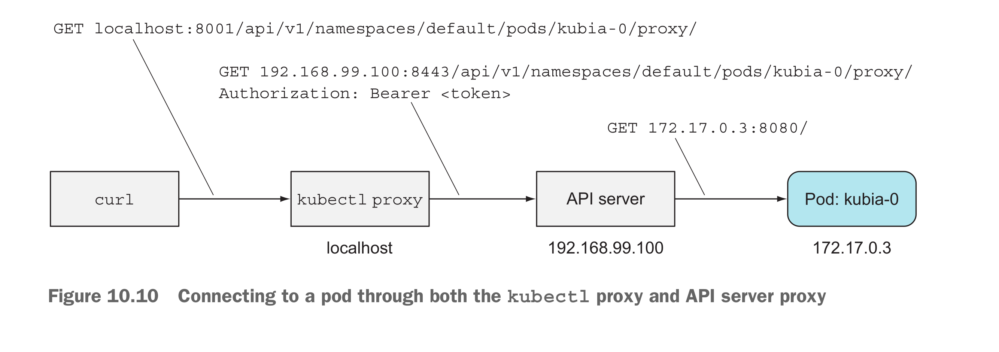
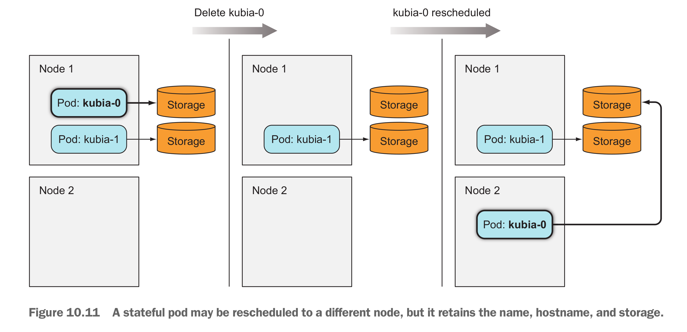
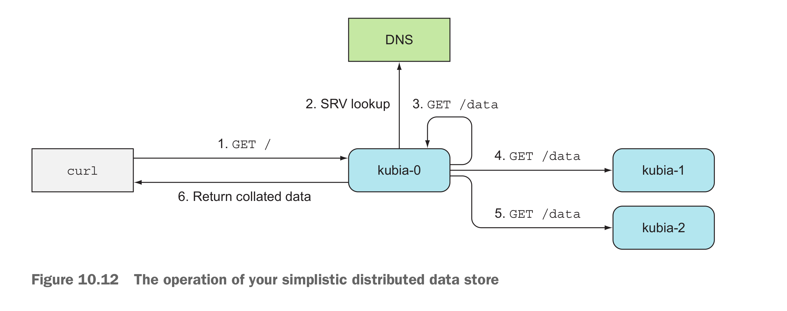

# StatefulSets - deploying replicated stateful applications
## Replicating stateful pods
### Compare StatefulSets with ReplicaSets or replication controllers
* Pod replicas managed by a ReplicaSet or ReplicationController are much like cattle. Since they are stateless applications
* When a stateful pod instance dies the new instance needs to get the same name, network identity, and state as the one it’s replacing
* Each pod created by a StatefulSet is assigned an ordinal index (zero-based
* a StatefulSet requires you to create a corresponding governing headless Service that’s used to provide the actual network identity to each pod.
* Example: if the governing Service belongs to the default namespace and is called foo, and one of the pods is called A-0, you can reach the pod through its fully qualified domain name, which is **a-0.foo.default.svc.cluster.local**
* StatefulSets also never permit scale-down operations if any of the instances are unhealthy
### Providing stable dedicated storage to each stateful instance
* TEAMING UP POD TEMPLATES WITH VOLUME CLAIM TEMPLATES
  * 
* Scale down stateful set pods doesn't delete PVC
  * 
* STATEFULSET’S AT-MOST-ONE SEMANTICS
  * StatefulSet must be absolutely certain that a pod is no longer running before it can create a replacement pod
* ways to connect to a pod directly:
  * by piggybacking on anotherpod and running curl inside it, 
  * by using port-forwarding, and so on. 
  * **use the API server as a proxy to the pods.**
  * Commands:
    * `kubectl proxy` first
    * `curl localhost:8001/api/v1/namespaces/tongwei/pods/kubia-0/proxy/` to access the stateful sets pod
    * 
* What happened if one of the statefulsets pod is deleted:
  * 
* Scaling a statefulset 
  * Scaling down a StatefulSet and scaling it back up after an extended time period should be no different than deleting a pod and having the StatefulSet recreate it immediately.
* EXPOSING STATEFUL PODS THROUGH A REGULAR, NON-HEADLESS SERVICE
  * **use the API server to access the clusterIP service** 
## Discovering peers in a StatefulSet
* Each member of a StatefulSet needs to easily find all the other members
* SRV RECORDS - One of the DNS records
  * kubectl run -it srvlookup --image=tutum/dnsutils --rm -- dig SRV kubia.default.svc.cluster.local
* For a pod to get a list of all the other pods of a StatefulSet, all you need to do is perform an SRV DNS lookup.
  * Node JS example
    * dns.resolveSrv("kubia.default.svc.cluster.local", callBackFunction);
* Discovering peers in a sample app
  * 
### Updating a StatefulSets
* `kubectl edit` command or patch command
## Statefulset deal with node failure
* when a node appears to have failed, the StatefulSet can-not and should not create a replacement pod until it knows for certain that the pod is no longer running.
* But if the pod’s status remains unknown for more than a few minutes (this time is configurable), the pod is automatically evicted from the node.
* Deleting the pod manually
  * delete the statefulset pod with `kubectl delete`, but the pod is still there.
    * since the node has lost, the `kubelet` can't reponse to the API Server
  * Need to forcibly delete the pod
    * `kubectl delete po kubia-0 --force --grace-period 0`