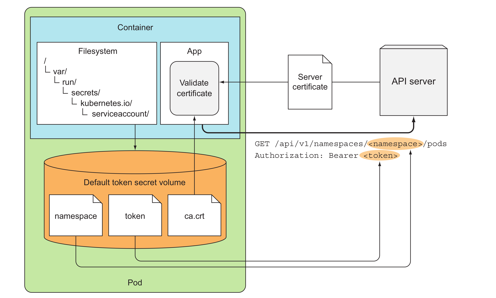

# Access pod metadata and other resources from apps
* Passing metadata through the Download API
  * Downward API, allows you to pass metadata about the pod and its env variables or files (in a downwardAPI volume)
  * Downward API allows you to pass bunch of information to the containers - C8.1.1
  * For environment variables exposing resource limits or requests, you specify a divisor. The actual value of the limit or the request will be divided by the divisor and the result exposed through the environment variable.
* Exposing metadata through env variables
  * check the downward-api-dev.yaml file
* Exposing metadata through file in a downward volume
  *  pod’s labels or its annotations only can be passed by file
  *  refer the downward-volume.yaml file
* container's resource requests exposed by volume or env variables
  * volume able to poss one container's resource fields to a different container within one pod
  * environment variable can only be passed its own resource limits and requests
* metadata available through the Downward API is limited, then go for Kubernetes API Server
## Kubernetes API Server
### REST API
*  `kube proxy` runs a proxy server accept HTTP connections on local machine and proxies them to the API server while taking care of authentication.
* Listing all job instances in the cluster 
  * `curl http://localhost:8081/apis/batch/v1/jobs`
* List a resource in a namespace by name
  * `curl http://localhost:8081/apis/batch/v1/namespaces/default/jobs/jobName`
### Talking to the API server from within a pod
* Three things are needed
  * Find the location of the API server.
  * Make sure talking to the API server, not something impersonating it.
  * Authenticate with the server.
* `/var/run/secrets/kubernetes.io/serviceaccount/` ca.crt file holds the certificate of the CA used to sign the **kubernetes API server's** certificate.
  * `curl --cacert` could be used to define the cacert location/ or set env variable **CURL_CA_BUNDLE**
* If you’re using a Kubernetes cluster with RBAC enabled, the service account may not be authorized to access (parts of) the API server.
  * workaround: k create clusterrolebinding permissive-binding --clusterrole=cluster-admin --group=system:serviceaccounts
* 