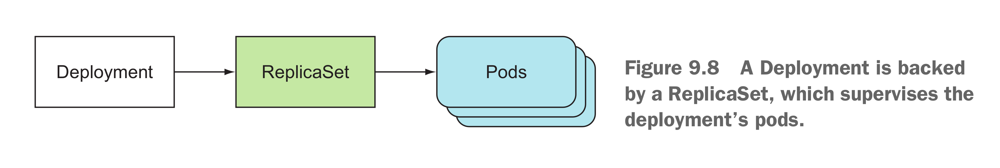
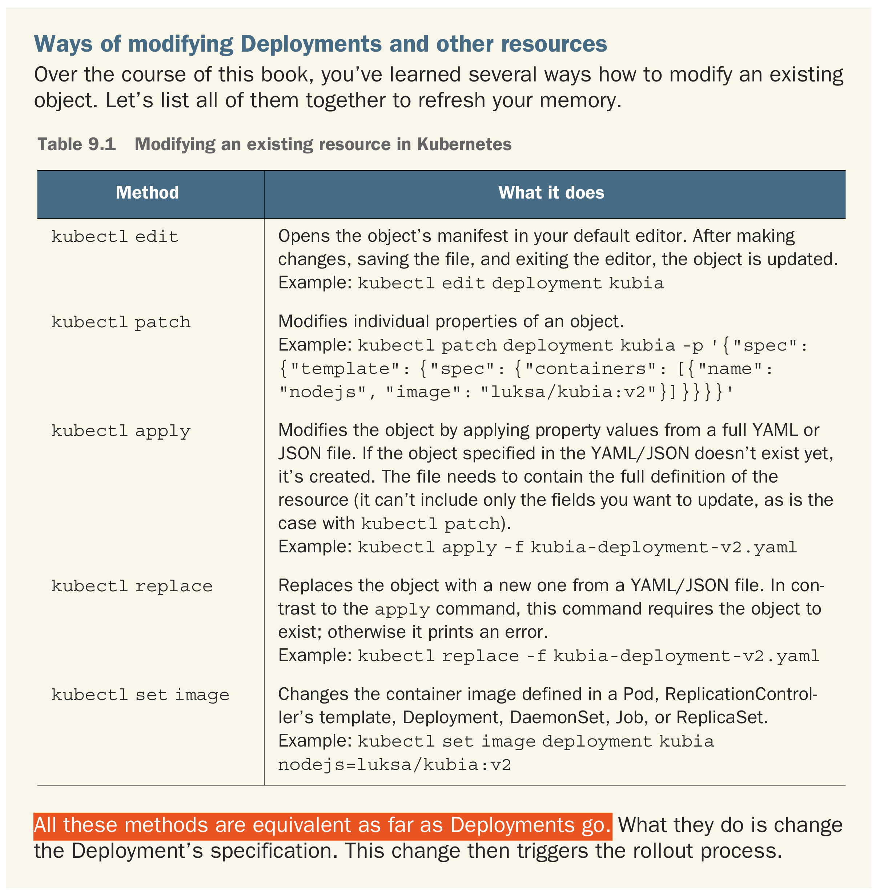
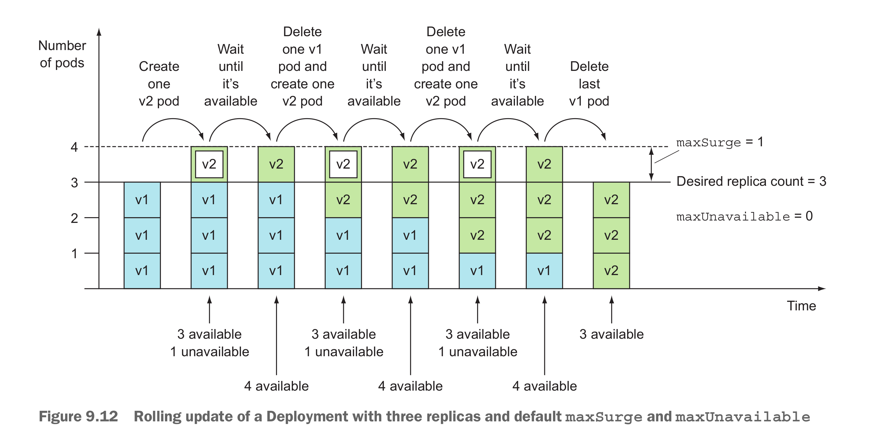

## Updating apps running in pods
# Rolling an update
* Set pod selector `kubectl set selector` 
* Endpoints sit between service and pods, `kubectl describe <service>` could check the Endpoints resource.
* You need to be aware that the default imagePullPolicy depends on the image tag. If a container refers to the latest tag (either explicitly or by not specifying the tag at all), imagePullPolicy defaults to Always, but if the container refers to any other tag, the policy defaults to IfNotPresent.
* `kubectl set image deployments/kubernetes-bootcamp kubernetes-bootcamp=jocatalin/kubernetes-bootcamp:v2` could be used to update the image of a deployment
* `rolling out` command has been deprecated.
  * the update commands were sent by client, if the network has some issues, not all the commands would be sent to server side.
## Using Deployments for updating apps declaratively
* Deployment is a higher level resource.
  * 
  * `kubectl get deployment` and `kubectl describe deployment` could be used to see the details of the Deployment.
  * The command specifically for checking a Deployment's status:
    * `kubectl rollout status deployment <deploymentName>`
    * `replicaset.apps/kubia-75449bf457` the number is the hashed value of the pod template in the Deployment and ReplicaSet managing the these pods
### Updating a Deployment
* Deployment default strategy is **RollingUpdate**, alternative is **Recreate**, which delete all old pods at once then recreate them.
* The `kubectl patch` command is useful for modifying a single property or a limited number of properties of a resource without having to edit its definition in a text editor.
* In simple words, the imperative approach is similar to cooking food and declarative approach is like ordering ready to eat food.
* Example of set command `kubectl set image deployment kubia nodejs=luksa/kubia:v2`
### Ways of modifying Deployments and other resources
* 
* `kubectl rollout undo deployment kubia` could be used to roll back to the previously deployed version
* Check deployment rollout history
  * `kubectl rollout history deployment kubia`
* Roll back to a specific deployment revision
  * `kubectl rollout undo deployment kubia --to-revision=1`
### Controlling the rate of the rollout
* **maxSurge** Determines how many pod instances you allow to exist above the desired replica count configured on the Deployment. When converting a percentage to an absolute number,the number is rounded **up**.
* **maxUnavailable** Determines how many pod instances can be unavailable relative to the desired replica count during the update. when converting a percentage to an absolute number, the number is rounded **down**.
  * 
* It’s important to keep in mind that maxUnavailable is relative to the desired replica count.
* the length of the revision history is limited by the **revisionHistoryLimit** property on the Deployment resource.
### Pausing the rollout process
* `kubectl set image deployment kubia nodejs=luksa/kubia:v4`
* `kubectl rollout pause deployment kubia`
  * RESUMING THE ROLLOUT
  * `kubectl rollout resume deployment kubia`\
### Blocking rollouts of bad versions
* The main function of minReadySeconds is to prevent deploying malfunctioning versions, not slowing down a deployment for fun.
* Usually, you’d set minReadySeconds to something much higher to make sure pods keep reporting they’re ready after they’ve already started receiving actual traffic.
* Define readiness probe and **minReadySeconds** could block the a bad version being rolled out.
* the rollout will be aborted automatically when the time specified in progressDeadlineSeconds is exceeded. Default is 600 seconds
### Set logging level
* by turning on verbose logging with the --v option when triggering the rolling update:
  * kubectl rolling-update kubia-v1 kubia-v2 --image=luksa/kubia:v2 --v 6