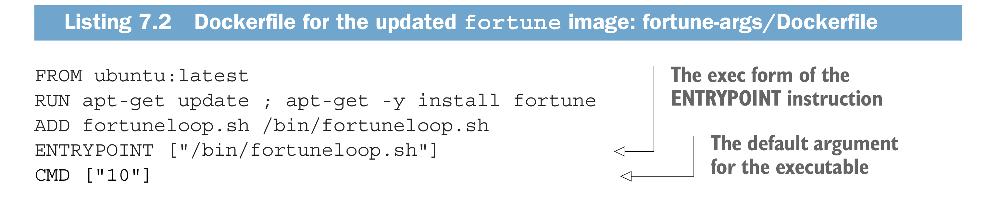
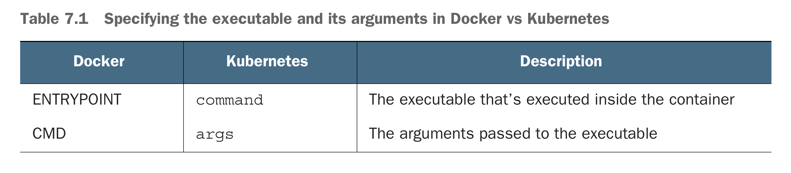
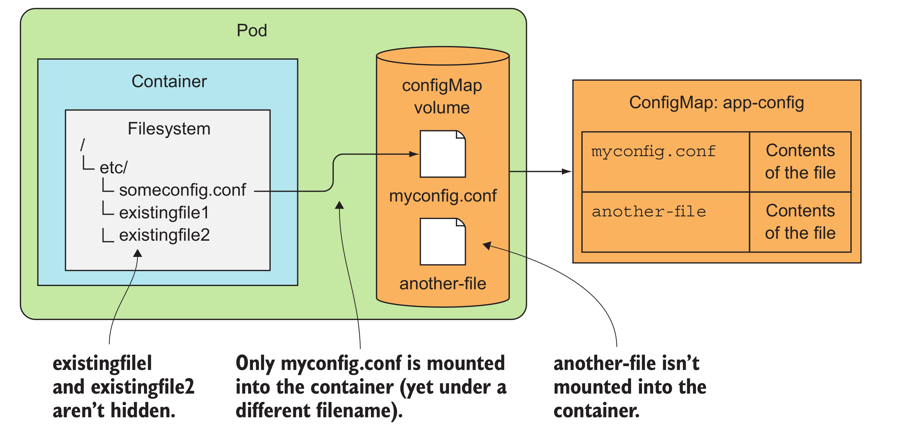

* Way to pass the configuration
    * pass command-line arguments
    * set custom env var
    * Mount configuration file into container via a volume
* ENTRYPOINT and CMD in Dockerfile
  * ENTRYPOINT defines the executable invoked when the container is started
  * CMD specifies the arguments that get passed to the ENTRYPOINT
  * Although you can use the CMD instruction to specify the command you want to execute when the image is run, the correct way is to do it through the ENTRYPOINT instruction and to only specify the CMD if you want to define the default arguments. The image can then be run without specifying any arguments
* Difference of ENTRYPOINT node app.js and ENTRYPOINT ["node", "app.js"]
  * ENTRYPOINT node app.js run the process inside the container's processes
  * ENTRYPOINT ["node", "app.js"], this run the node process directly, not inside of the shell

* Kubernets is able to override ENTRYPOINT and CMD by setting **command** and **args** in the container
* 
## Passing command-line arguments to containers
* Defining the command and arguments in Dcoker
* Overriding the command and arguments in kubernetes
* Settings env var for a container
  * Kubernetes allows you to specify a custom list of environment variables for each container of a pod
  * Set **env** in contaners spec section
  * Refer to other env in var's value
    ```
    env:
    - name: FIRST_VAR
    value: "foo"
    - name: SECOND_VAR
    value: "$(FIRST_VAR)bar"
    ```
* Move configuration out of the pod description
* Pass ConfigMap to a container as an env var
  * settings an env var in **env** with valueFrom
  * passing all entries of a ConfigMap as env vars at once by using **envFrom** directly.
  * passing a ConfigMap entry as a command-line argument
    ```
    apiVersion: v1
    kind: Pod
    metadata:
    name: fortune-args-from-configmap
    spec:
    containers:
    - image: luksa/fortune:args
    env:
    - name: INTERVAL
    valueFrom:
    configMapKeyRef:
    name: fortune-config
    key: sleep-interval
    args: ["$(INTERVAL)"]
    ```
## Using a configMap volume to expose ConfigMap entries as files
* A ConfigMap, as you’ve seen, can also contain whole config files. When you want to expose those to the container, you can use one of the special volume types I mentioned in the previous chapter, namely a configMap volume.
* A configMap volume will expose each entry of the ConfigMap as a file.
* UNDERSTANDING THAT MOUNTING A DIRECTORY HIDES EXISTING FILES IN THAT DIRECTORY
* An additional subPath property on the volumeMount allows you to mount either a single file or a single directory from the volume instead of mounting the whole volume.
* 
* Using a ConfigMap and exposing it through a volume brings the ability to update the configuration without having to recreate the pod or even restart the container.
## Secret
* Secret could be used the same way as ConfigMap
  * Pass Secret entries to the container as env variables
  * expose secret entries as files in a volume
* The  **default-token** is mounted into every container, but **automountServiceAccountToken** field is able to disable the default secret mount to every container.
## Generate the certificate and private key files
```
openssl genrsa -out https.key 2048
openssl req -new -x509 -key https.key -out https.cert -days 3650 -subj /CN=www.kubia-example.com
kubectl create secret generic fortune-https --from-file=https.key --from-file=https.cert --from-file=foo
```
* The reason for using Base64 encoding is simple. A Secret’s entries can contain binary values.
* Because not all sensitive data is in binary form, Kubernetes also allows setting a Secret’s values through the stringData field
* Expose the **Secret** to a container through a secret volume or through an env variable, the value of the secret entry is decoded and written to the file in its actual form
* configMap volume **path** is attaching after the container volumeMounts