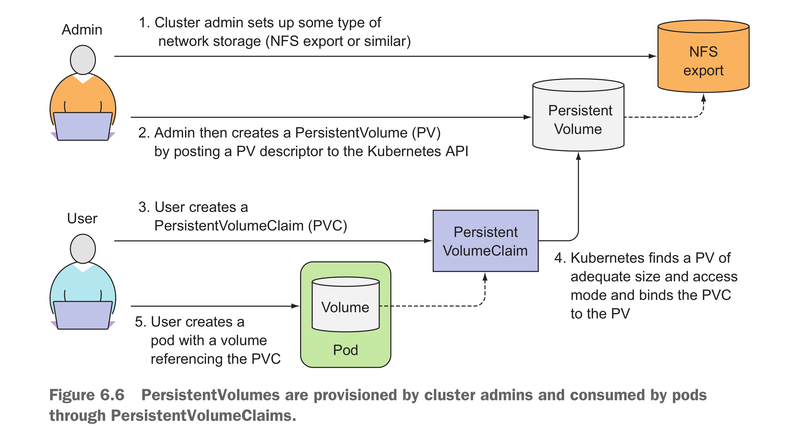
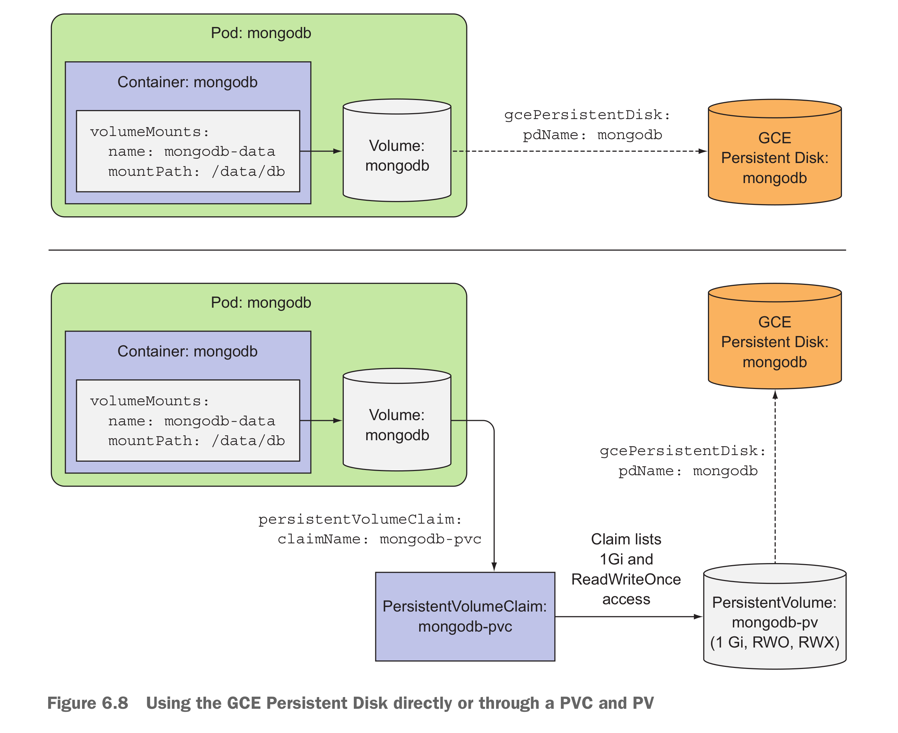

* Each container in a pod has its own isolated filesystem.
* a volume is created when the pod is started and is destroyed when the pod is deleted.
* It’s not enough to define a volume in the pod; you need to define a VolumeMount inside the container’s spec also.
* Different types of Volumes
    * Special types of volumes
        * secret
        * downwardAPI
        * configMap
* Volumes can also be used by a single container for when a container needs to write data to disk temporarily, such as when performing a sort operation on a large dataset.
* Volume types:
  * `emptyDir`
  * `gitRepo` is an emptyDir and populated by clone a version of git repo
  * `hostPath` points to a specific file or directory on node's filesystem.

* `ENTRYPOINT` in Dockerfile is used to define the command that image is run.
* Recall about access the service through the clusterIP and NodePort from the external of the node
    * From inside of the cluster, the service could be reached out from the inside of the cluster with internal clusterIP or NodeIP:NodePort
    * From outside of the cluster, the service could only be reached out from the NodeIP:NodePort
* `emptyDir` could set the medium to store files to memory, default location is the file system of the node's disk
* `gitRepo` could be start an emptyDir then clone the git repo into the volumes, - tried with volumegit.yaml
  * git repo won'be sync automatically, only when the pod was restart - volumes get re-created. The files would clone from git repo and get the updated files.
* `hostPath` used to read/write system files on node, don't use them to persist data across pods.
* persistent storage - if the data has to be accessible across multiple nodes, the storage has to be some type of network-related storage(NAS).
* shell into mongo image: `k exec -it mongodb -- mongosh`
* Cloud provider
  * Goole K8S Engine - GCE persistence disk
  * AWS EC2 - awsElasticBlockStore volume to provide persistent storage for your pods
  * Microsoft Azure - azureFile/azureDisk
* Cons: define the volumes in pod definition
  * pod defintion is tied to a specific K8S cluster, not able to use in other clusters with different provider
  * solution: `PersistentVolumes` and `PersistentVolumesClaims`
  * it decouples the pods from the underlying storage technology
* 
* PersistentVolumes don't belong to any namespace, it's cluster level resources like nodes
* RWO, ROX, and RWX pertain to the number of worker nodes that can use the volume at the same time, not to the number of pods!
* developer doesn’t have to know anything about the actual storage technology by use pv and pvc
* 