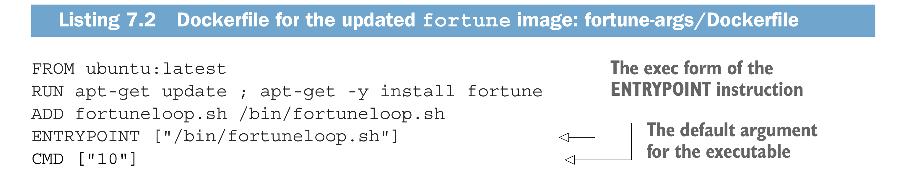
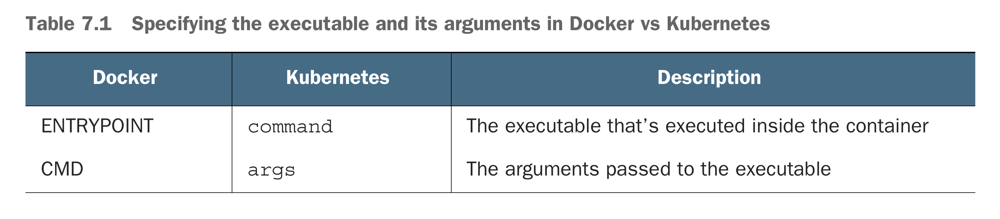

* Way to pass the configuration
    * pass command-line arguments
    * set custom env var
    * Mount configuration file into container via a volume
* ENTRYPOINT and CMD in Dockerfile
  * ENTRYPOINT defines the executable invoked when the container is started
  * CMD specifies the arguments that get passed to the ENTRYPOINT
  * Although you can use the CMD instruction to specify the command you want to execute when the image is run, the correct way is to do it through the ENTRYPOINT instruction and to only specify the CMD if you want to define the default arguments. The image can then be run without specifying any arguments
* Difference of ENTRYPOINT node app.js and ENTRYPOINT ["node", "app.js"]
  * ENTRYPOINT node app.js run the process inside the container's processes
  * ENTRYPOINT ["node", "app.js"], this run the node process directly, not inside of the shell

* Kubernets is able to override ENTRYPOINT and CMD by setting **command** and **args** in the container
* 